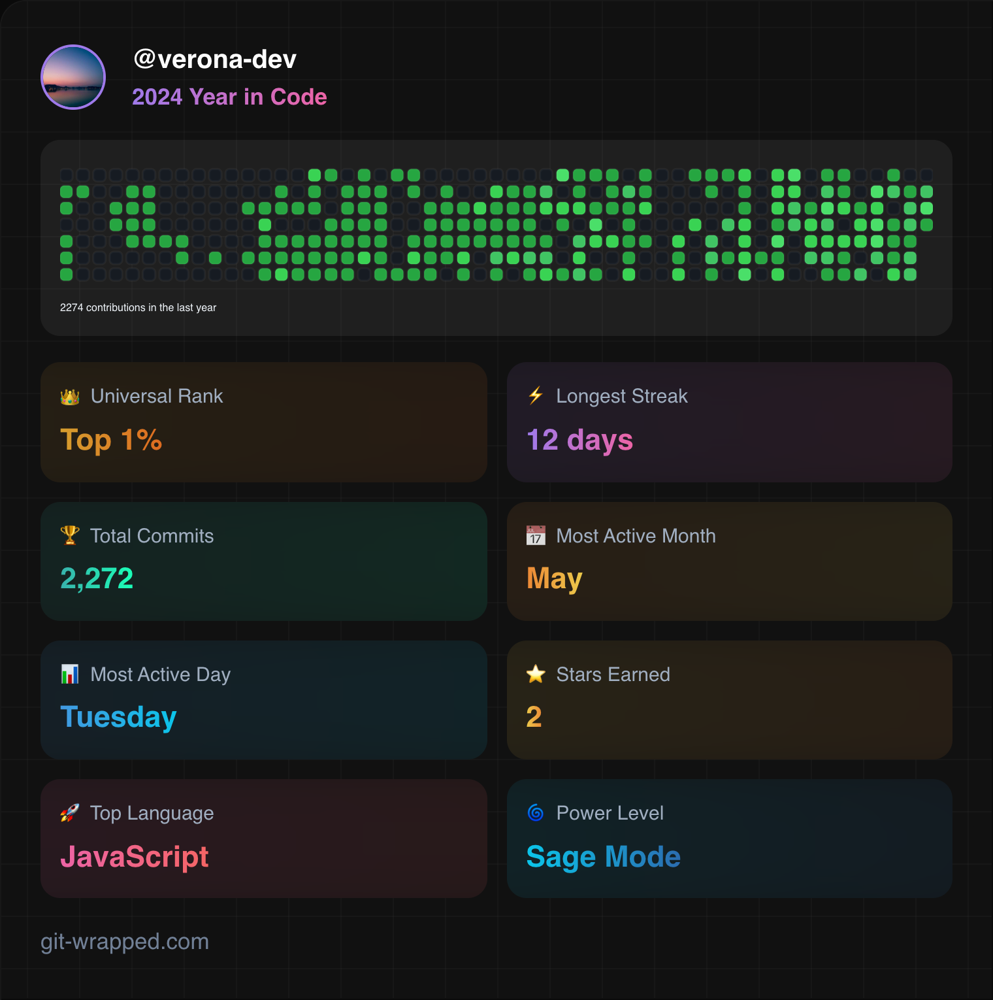

  

## Skills
  <table><tr><td valign="top" width="50%">
  
  ### Languages and Tools  
  
  
      
      
      
       
    
    
    
       
     
    
    
    
    
  

  </td><td valign="top" width="50%">
  
  ### Other  
  
  
      
    
    
    
    
    
    
  

  </td></tr>
  </table>  

   &nbsp;

  # Project Showcase
  

    
  

  
  &nbsp;
    
  
  
  &nbsp;
  
  

  
